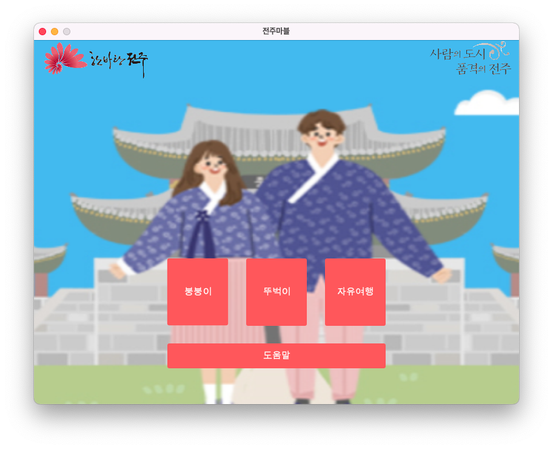
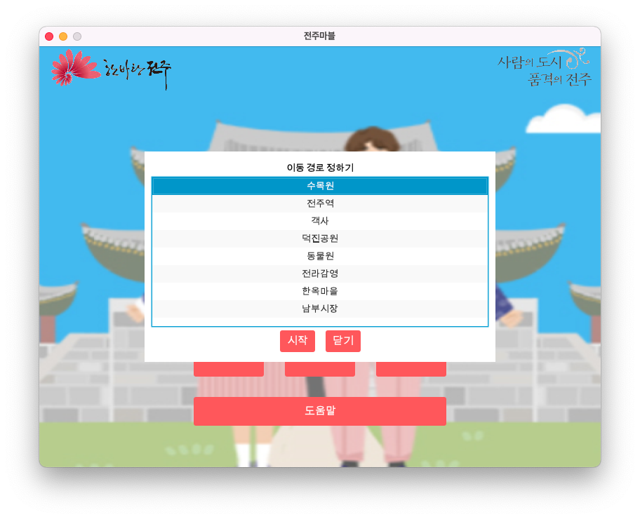
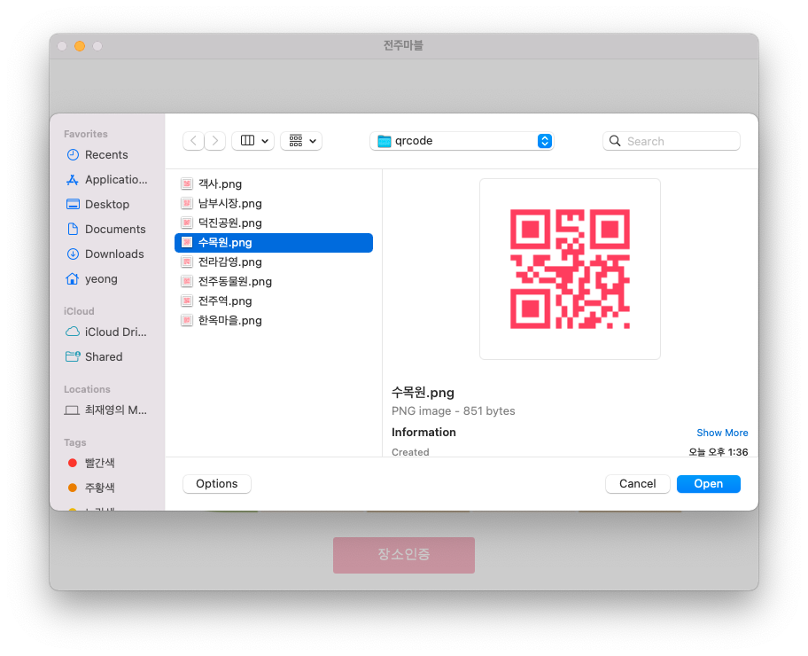
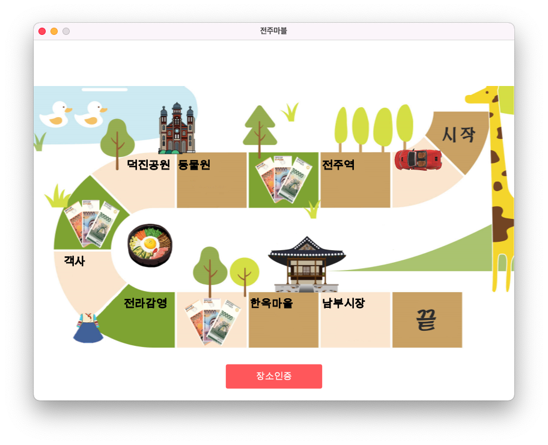
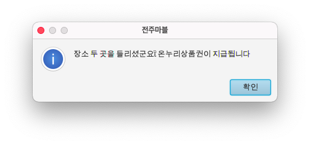

# JeonjuMarble
`2020 교내 소프트웨어 부트캠프 프로젝트`

---
### 주제
지역 상권에 도움되는 프로젝트

### 개요
전주 여행에 보드게임판으로 편한 동선을 제공해줌과 동시에 QR코드로 장소 인증을 하면 인증 횟수마다 상품을 주어 전주 여행에 재미를 주기 위한 서비스

### 설명

타이틀 화면입니다.

자신의 이동수단에 맞는 버튼을 눌러 경로를 설정합니다.

---

타이틀 화면에서 자유여행 버튼을 누르면 나타나는 다이얼로그입니다.

드래그하여 경로를 직접 설정할 수 있습니다.

---

메인 화면입니다.

설정된 경로를 순서로 생선된 보드판과 말이 표시됩니다. 말의 다음 보드가 방문해야 할 장소입니다.

장소인증 버튼을 눌러 QR코드 이미지를 선택해 장소방문을 인증할 수 있습니다.

---

QR코드 선택화면입니다.

프로그램 플랫폼상 카메라인식이 아닌 이미지 선택방식으로 채택하였습니다.

---

장소가 인증되면 말이 다음칸으로 이동합니다.

---

잘못된 QR코드를 인식하면 다음 방문장소를 알려줍니다.

---

장소 두곳을 방문하면 나타나는 창입니다.

